# README - Quản Lý Cửa Hàng Sách

## 1. Giới Thiệu

Dự án **"Quản Lý Cửa Hàng Sách"** nhằm xây dựng một hệ thống quản lý bán hàng, sách và khách hàng. Dự án bao gồm các thành phần sau:

- **ERD**: Mô hình thực thể - mối quan hệ.  
- **Lược đồ quan hệ**: Mô hình quan hệ dữ liệu chi tiết.  
- **Giao diện**: Bản thiết kế giao diện trên Figma.

## 2. Tài Liệu Tham Khảo

- **ERD**: [Xem chi tiết](https://drive.google.com/file/d/1bkfJWHC-A9O--ufoVtGS_39se0vjY4DL/view?usp=sharing)  
- **Lược đồ quan hệ**: [Xem chi tiết](https://dbdiagram.io/d/67ca7ea7263d6cf9a089ee24)  
- **Figma (Giao diện)**: [Xem chi tiết](https://www.figma.com/design/tpEv1Ks9hfGA4MKJMsvBXt/App-QL-C%E1%BB%ADa-h%C3%A0ng-S%C3%A1ch?node-id=1-3&t=QUtxeAGy5DxXsTU7-1)

## 3. Cài Đặt & Triển Khai
1. Tải source code về:

   ```bash
   git clone https://github.com/JacketHeee/QLCuaHangBanSach.git
   ```
2. Mở xampp và vào trang http://localhost/phpmyadmin/ tạo 1 database mới có tên là quanlycuahangbansach và import cơ sở dữ liệu trong folder database -> file quanlycuahangbansach.sql trong source code.

3. Sử dụng VSCODE để chạy source code.
### Tài khoản Admin
- Username: admin
- Password: 123456

## 4. Các thao thác với git
| Bước | Lệnh Git / Thao tác | Mô tả chi tiết |
|------|---------------------|----------------|
| **1** | `git init` hoặc `git clone <repository-url>` | Khởi tạo repository Git mới (`init`) hoặc sao chép một repository có sẵn từ URL (`clone`). |
| **2** | `git branch <branch-name>` | Tạo một nhánh mới để phát triển tính năng hoặc sửa lỗi. Mỗi thành viên nên làm việc trên một nhánh riêng. |
| **3** | `git checkout <branch-name>` | Chuyển sang nhánh bạn vừa tạo để làm việc. |
| **4** | Thực hiện các thay đổi code | Thêm, chỉnh sửa hoặc xóa tệp. Lưu các thay đổi sau khi thực hiện xong. |
| **5** | `git add .` | Thêm tất cả các thay đổi vào khu vực tạm (staging area). Bạn cũng có thể chỉ định tệp cụ thể bằng cách dùng `git add <file>`. |
| **6** | `git commit -m "Thông điệp commit"` | Lưu lại thay đổi vào repository với một thông điệp mô tả rõ ràng về những thay đổi vừa thực hiện. |
| **7** | `git pull origin main` | Lấy những thay đổi mới nhất từ nhánh chính (main) của repository từ xa về máy của bạn. |
| **8** | Giải quyết xung đột (nếu có) | Nếu có xung đột (conflict) xảy ra giữa nhánh của bạn và nhánh chính, bạn cần chỉnh sửa mã để giải quyết và tiếp tục. |
| **9** | `git push origin <branch-name>` | Đẩy những thay đổi từ nhánh của bạn lên repository từ xa (GitHub, GitLab, v.v.). |
| **10** | Tạo Pull Request (PR) | Vào repository trên nền tảng như GitHub và tạo một Pull Request để yêu cầu người khác xem xét và hợp nhất nhánh của bạn vào nhánh chính. |
| **11** | Review và Merge | Các thành viên khác review Pull Request của bạn. Sau khi đồng ý, Pull Request sẽ được hợp nhất vào nhánh chính. |
| **12** | `git fetch` và `git pull` | Lấy về những thay đổi mới nhất từ nhánh chính sau khi Pull Request đã được hợp nhất. |
| **13** | Xóa nhánh cũ (tùy chọn) | Sau khi đã hợp nhất nhánh vào nhánh chính, bạn có thể xóa nhánh cũ bằng lệnh `git branch -d <branch-name>`. |

### **Lưu ý:**
- **Tạo nhánh**: Mỗi thành viên nên tạo nhánh riêng khi làm việc trên các tính năng hoặc sửa lỗi để tránh xung đột.
- **Pull Request**: Luôn tạo Pull Request và để các thành viên khác review trước khi hợp nhất vào nhánh chính.
- **Giải quyết xung đột**: Xung đột có thể xảy ra khi nhiều người làm việc trên cùng tệp. Sử dụng công cụ như VSCode để hỗ trợ giải quyết xung đột.

### **Một số lệnh Git hữu ích khác**:
| Lệnh | Mô tả |
|------|-------|
| `git status` | Kiểm tra trạng thái repository hiện tại. |
| `git log` | Hiển thị lịch sử commit. |
| `git reset --hard <commit>` | Hoàn tác thay đổi và quay lại commit chỉ định. |
| `git stash` | Lưu tạm thời các thay đổi hiện tại mà không commit. |
| `git merge <branch-name>` | Hợp nhất một nhánh vào nhánh hiện tại. |


## 5. Ảnh giao diện ứng dụng

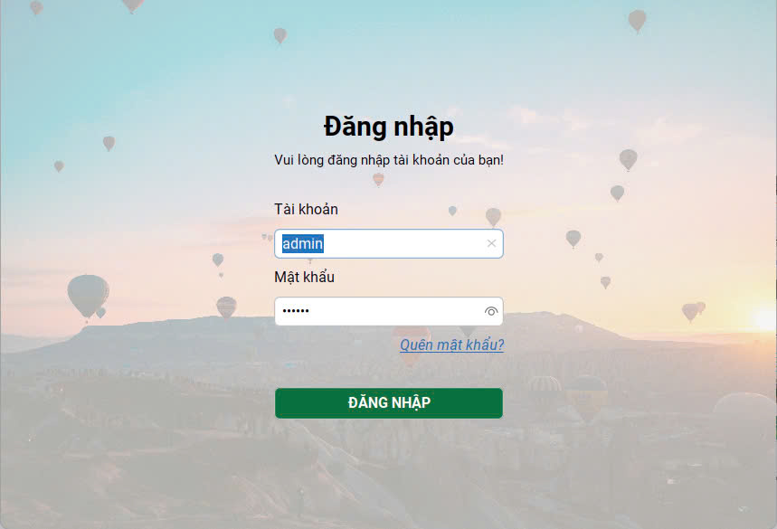
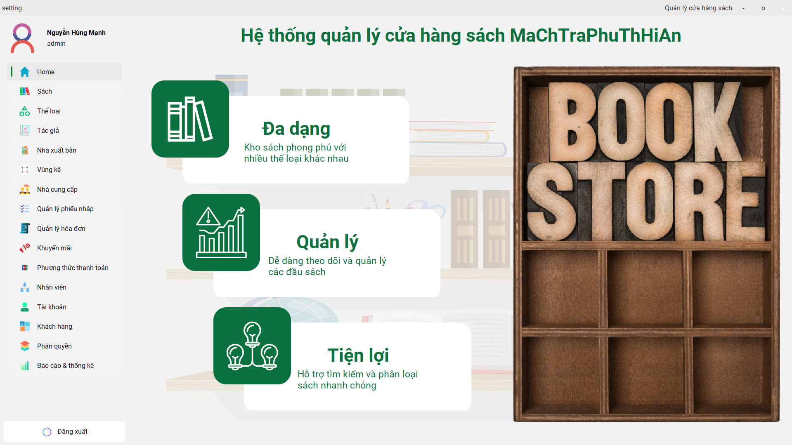
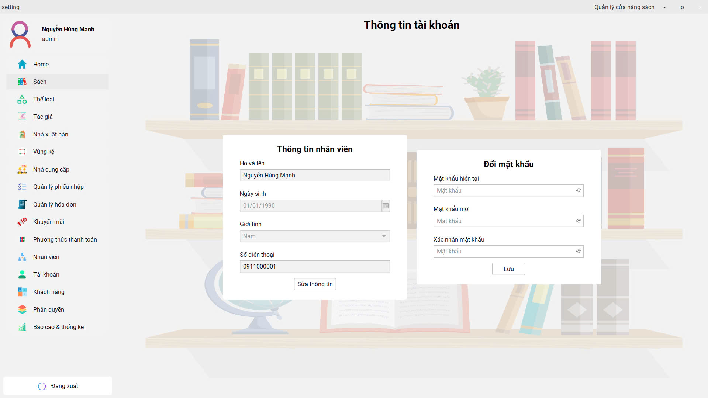
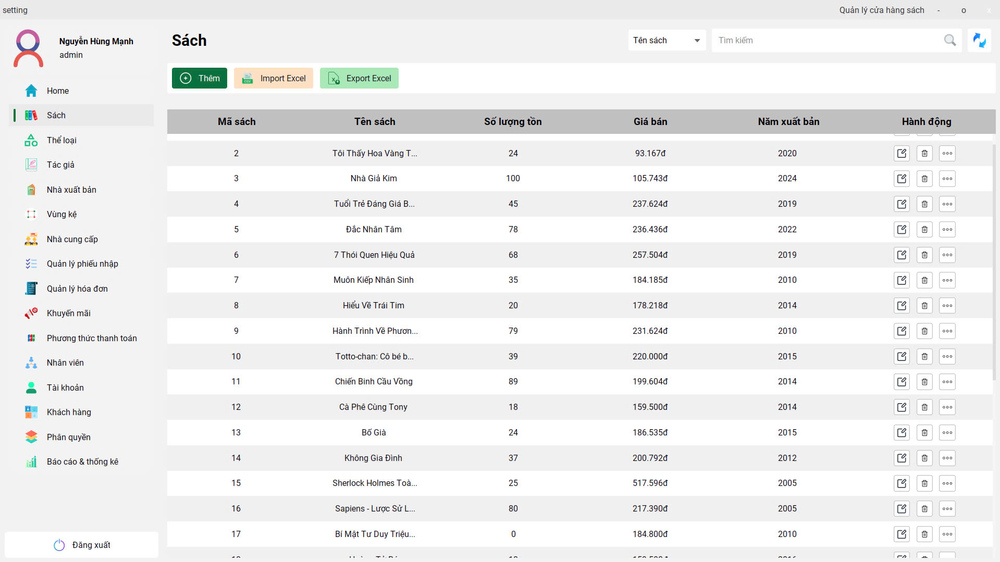
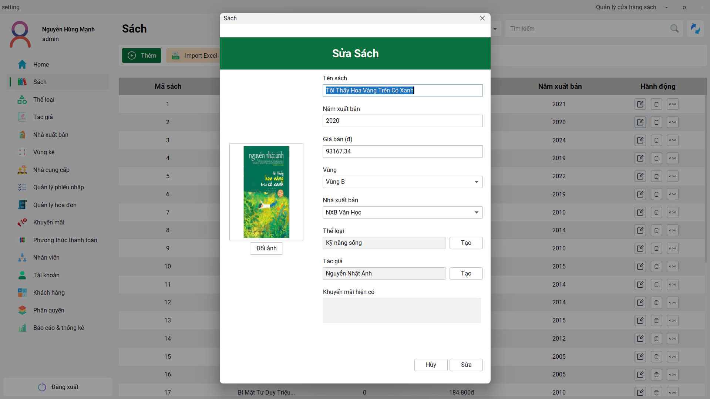
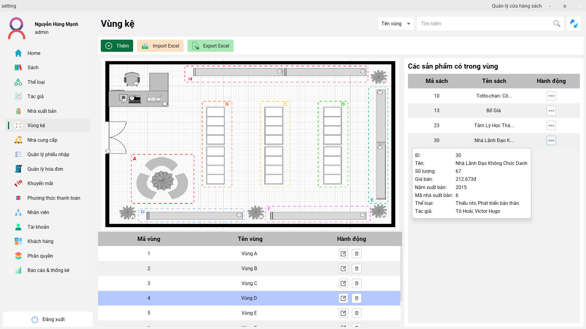
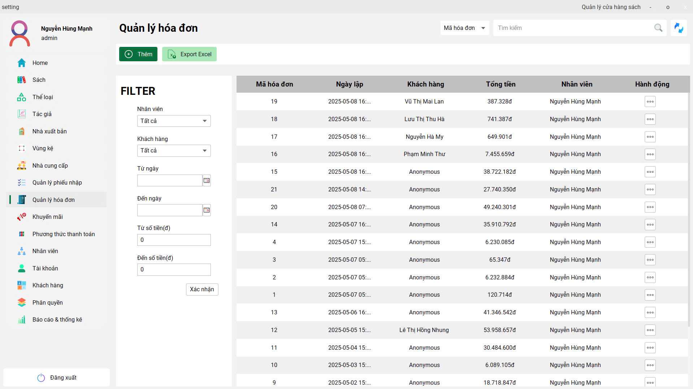
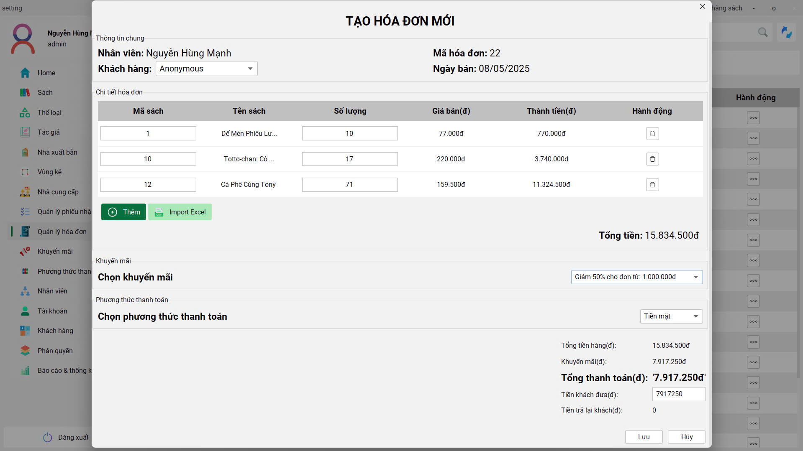
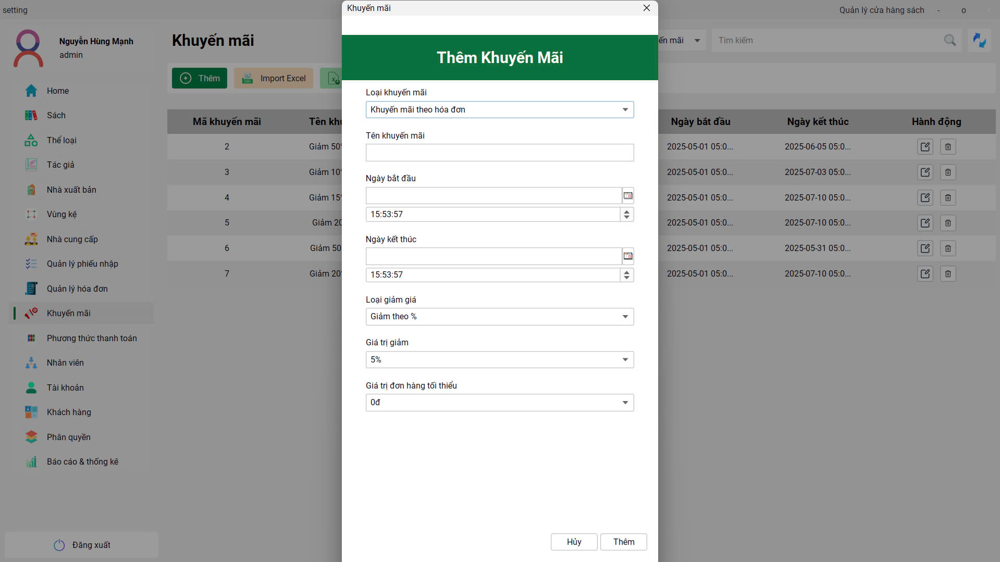
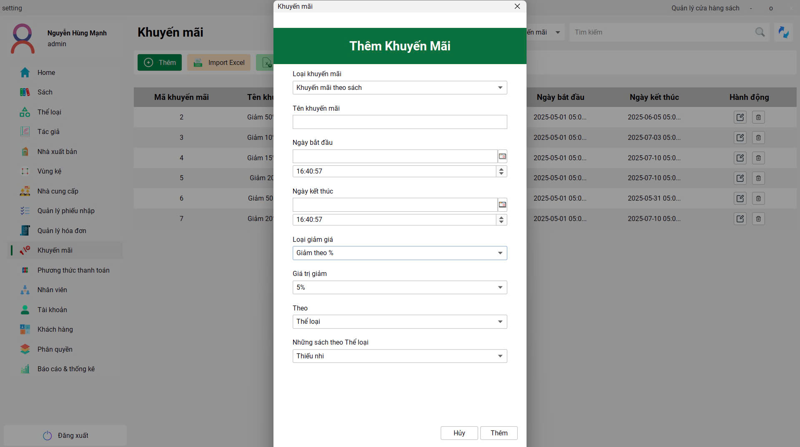
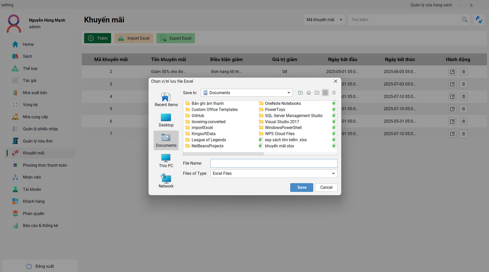
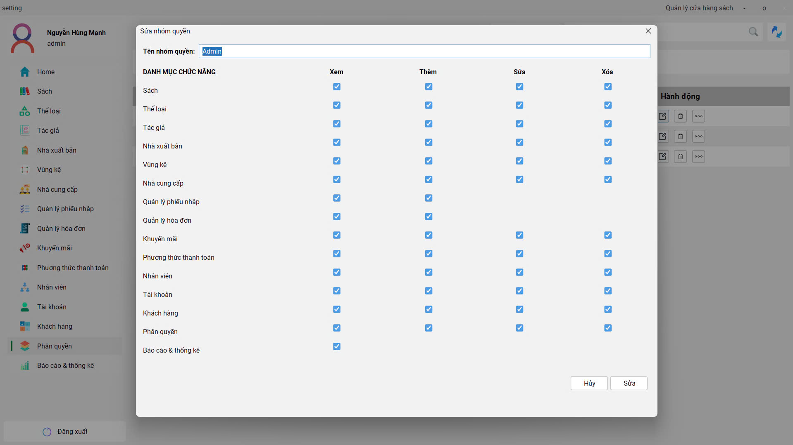
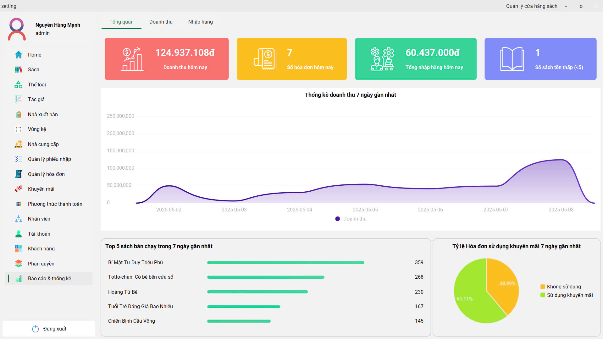
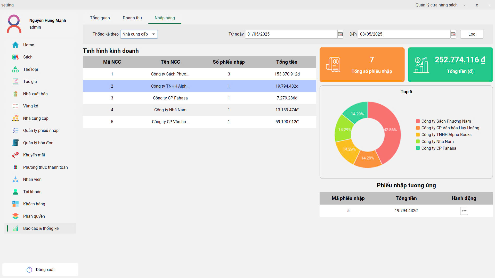
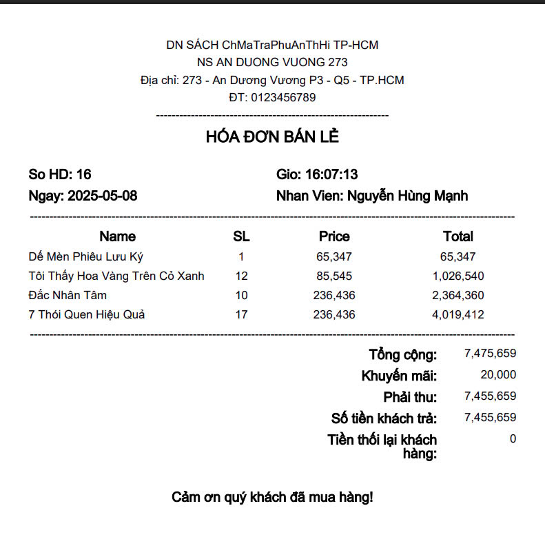
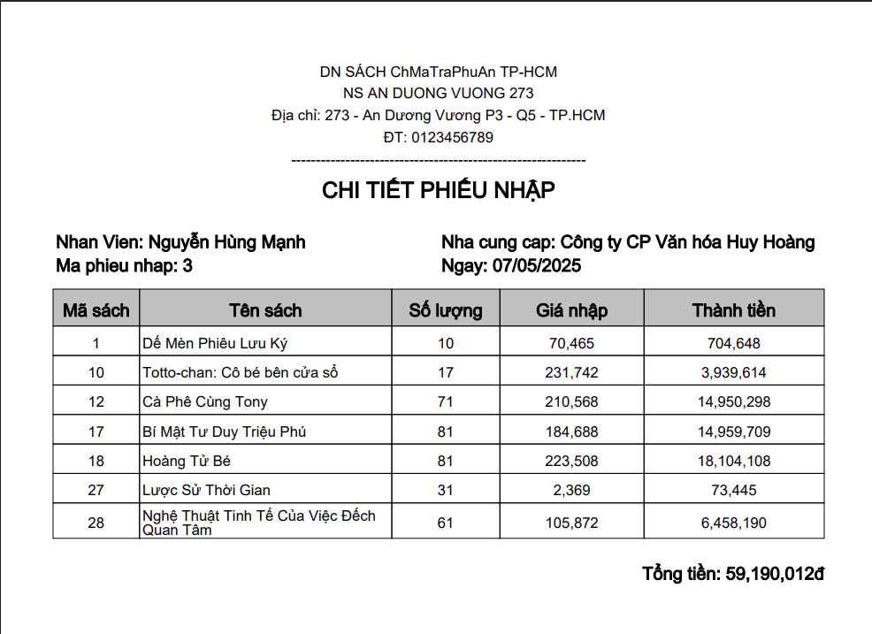
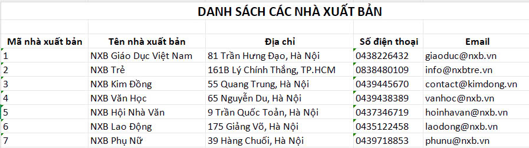